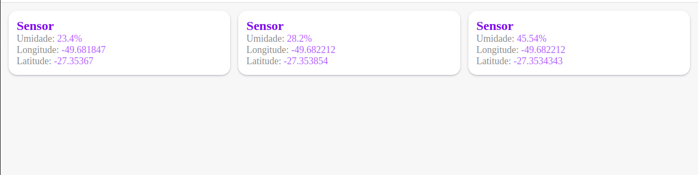
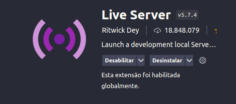
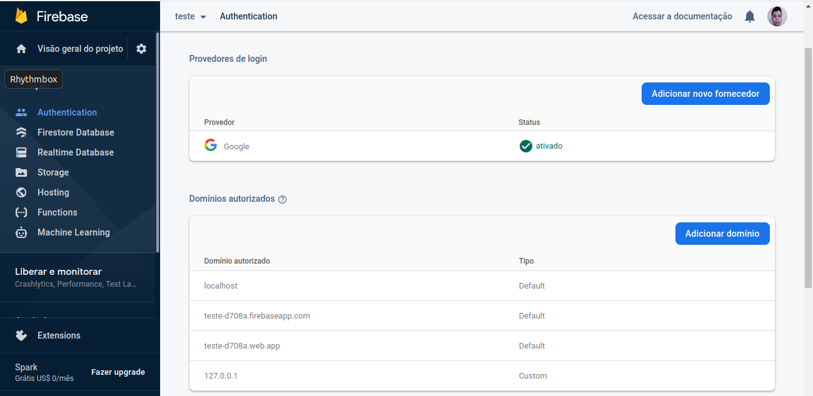
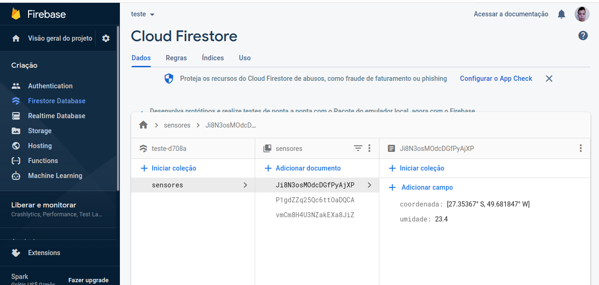

# Firebase Test

## Paine de Controle

## Configuração: VS-Code + Live Server

### Instale o Live Server

### Adicione o domínio 127.0.0.1 no firebase

Caminho: Criação > Authentication > Sign-in method > Domínios autorizados > Adicionar domínio

## Crie o banco de dados

